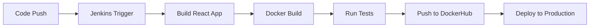

# 🚀 Job Portal - DevOps Enhanced

[](https://hub.docker.com/r/syednasir9/job-portal-frontend)
[](https://reactjs.org/)
[](https://www.jenkins.io/)
[](https://opensource.org/licenses/MIT)

A modern, responsive job portal web application built with React.js and enhanced with DevOps best practices. This project demonstrates full-stack development skills combined with containerization, CI/CD pipelines, and automated deployment workflows.


## 📋 Table of Contents

- [Features](#-features)
- [Demo](#-demo)
- [Tech Stack](#-tech-stack)
- [Quick Start](#-quick-start)
- [Docker Setup](#-docker-setup)
- [DevOps Pipeline](#-devops-pipeline)
- [Project Structure](#-project-structure)
- [API Documentation](#-api-documentation)
- [Contributing](#-contributing)
- [License](#-license)

## ✨ Features

### 🔍 **Job Search & Discovery**
- Advanced search functionality by job title and location
- Real-time filtering and sorting capabilities
- Detailed job descriptions with company information

### 🏢 **Company Profiles**
- Comprehensive company listings
- Company-specific job postings
- Company details and culture information

### 📝 **Job Management**
- Intuitive job posting interface
- Form validation and error handling
- Real-time job status updates

### 🎨 **User Experience**
- Fully responsive design for all devices
- Toast notifications for user feedback
- Smooth client-side routing with React Router
- Loading states and error boundaries

### 🐳 **DevOps Integration**
- Containerized application with Docker
- Automated CI/CD pipeline with Jenkins
- DockerHub integration for container registry
- Production-ready deployment configuration

## 🛠️ Tech Stack

### **Frontend**
| Technology | Purpose | Version |
|------------|---------|---------|
|  | Core Framework | ^18.0.0 |
|  | Client-side Routing | ^6.0.0 |
|  | Markup | Latest |
|  | Styling | Latest |

### **Notifications & State**
| Technology | Purpose | Version |
|------------|---------|---------|
|  | Toast Notifications | ^9.0.0 |
| React useState | State Management | Built-in |

### **DevOps & Deployment**
| Technology | Purpose | Version |
|------------|---------|---------|
|  | Containerization | ^20.0.0 |
|  | CI/CD Pipeline | ^2.400+ |
|  | Web Server | ^1.21 |
|  | Container Registry | Latest |

## 🚀 Quick Start

### Prerequisites

Before you begin, ensure you have the following installed:
-  **Node.js** (v14.0.0 or higher)
-  **npm** (v6.0.0 or higher)
-  **Docker** (optional, for containerized deployment)

### Installation

1. **Clone the repository**
   ```bash
   git clone https://github.com/yourusername/job-portal-devops.git
   cd job-portal-devops
   ```

2. **Install dependencies**
   ```bash
   npm install
   ```

3. **Start the development server**
   ```bash
   npm start
   ```

4. **Open your browser**
   ```
   http://localhost:3000
   ```

## 🐳 Docker Setup

### Building the Docker Image

```bash
# Build the Docker image
docker build -t syednasir9/job-portal-frontend .

# Run the container locally
docker run -p 3000:80 syednasir9/job-portal-frontend
```

### Using Pre-built Image from DockerHub

```bash
# Pull and run the latest image
docker pull syednasir9/job-portal-frontend:latest
docker run -p 3000:80 syednasir9/job-portal-frontend:latest
```

### Docker Compose (Optional)

```yaml
version: '3.8'
services:
  job-portal:
    image: syednasir9/job-portal-frontend:latest
    ports:
      - "3000:80"
    restart: unless-stopped
```

## ⚙️ DevOps Pipeline

### Jenkins CI/CD Workflow

Our automated pipeline includes the following stages:



### Pipeline Configuration

1. **Build Stage**: Compiles React application
2. **Test Stage**: Runs unit and integration tests
3. **Docker Stage**: Creates optimized container image
4. **Push Stage**: Uploads image to DockerHub registry
5. **Deploy Stage**: Automatically deploys to production environment

### Jenkinsfile Example

```groovy
pipeline {
    agent any
    
    stages {
        stage('Build') {
            steps {
                sh 'npm install'
                sh 'npm run build'
            }
        }
        
        stage('Docker Build') {
            steps {
                sh 'docker build -t syednasir9/job-portal-frontend .'
            }
        }
        
        stage('Push to DockerHub') {
            steps {
                withDockerRegistry([credentialsId: 'dockerhub-credentials']) {
                    sh 'docker push syednasir9/job-portal-frontend'
                }
            }
        }
    }
}
```

## 🔗 API Documentation

### Endpoints

| Method | Endpoint | Description |
|--------|----------|-------------|
| GET | `/api/jobs` | Fetch all job listings |
| GET | `/api/jobs/:id` | Get specific job details |
| POST | `/api/jobs` | Create new job posting |
| GET | `/api/companies` | List all companies |
| GET | `/api/companies/:id` | Get company profile |

### Example API Response

```json
{
  "id": "1",
  "title": "Frontend Developer",
  "company": "Tech Corp",
  "location": "San Francisco, CA",
  "type": "Full-time",
  "description": "We are looking for a talented Frontend Developer...",
  "requirements": ["React.js", "JavaScript", "CSS3"],
  "salary": "$80,000 - $120,000",
  "postedDate": "2024-01-15"
}
```

## 🤝 Contributing

We welcome contributions! Please follow these steps:

1. **Fork the repository**
2. **Create a feature branch**
   ```bash
   git checkout -b feature/amazing-feature
   ```
3. **Commit your changes**
   ```bash
   git commit -m 'Add some amazing feature'
   ```
4. **Push to the branch**
   ```bash
   git push origin feature/amazing-feature
   ```
5. **Open a Pull Request**

### Development Guidelines

- Follow React best practices and hooks patterns
- Write meaningful commit messages
- Add tests for new features
- Update documentation as needed
- Ensure Docker builds pass locally

## 📊 Performance Metrics

- ⚡ **Lighthouse Score**: 95+ Performance
- 🎯 **Core Web Vitals**: All metrics in green
- 📦 **Bundle Size**: < 500KB gzipped
- 🐳 **Docker Image**: < 50MB compressed

## 🔒 Security Features

- 🛡️ Input validation and sanitization
- 🔐 XSS protection
- 🚫 CSRF protection
- 📝 Content Security Policy headers
- 🔍 Regular dependency audits

## 📈 Future Enhancements

- [ ] User authentication and profiles
- [ ] Advanced search filters
- [ ] Email notifications
- [ ] Job application tracking
- [ ] Admin dashboard
- [ ] API rate limiting
- [ ] Database integration
- [ ] Kubernetes deployment

## 👤 Author

**Syed Nasir**
- GitHub: [@syednasir9](https://github.com/syednasir9)
- LinkedIn: [Your LinkedIn](https://www.linkedin.com/in/syednasir111-/)

## 🙏 Acknowledgments

- React.js team for the amazing framework
- Docker community for containerization best practices
- Jenkins community for CI/CD automation tools
- Open source contributors who made this project possible

---
